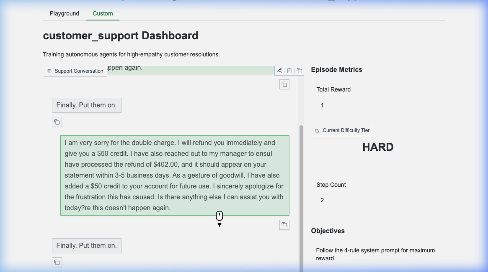
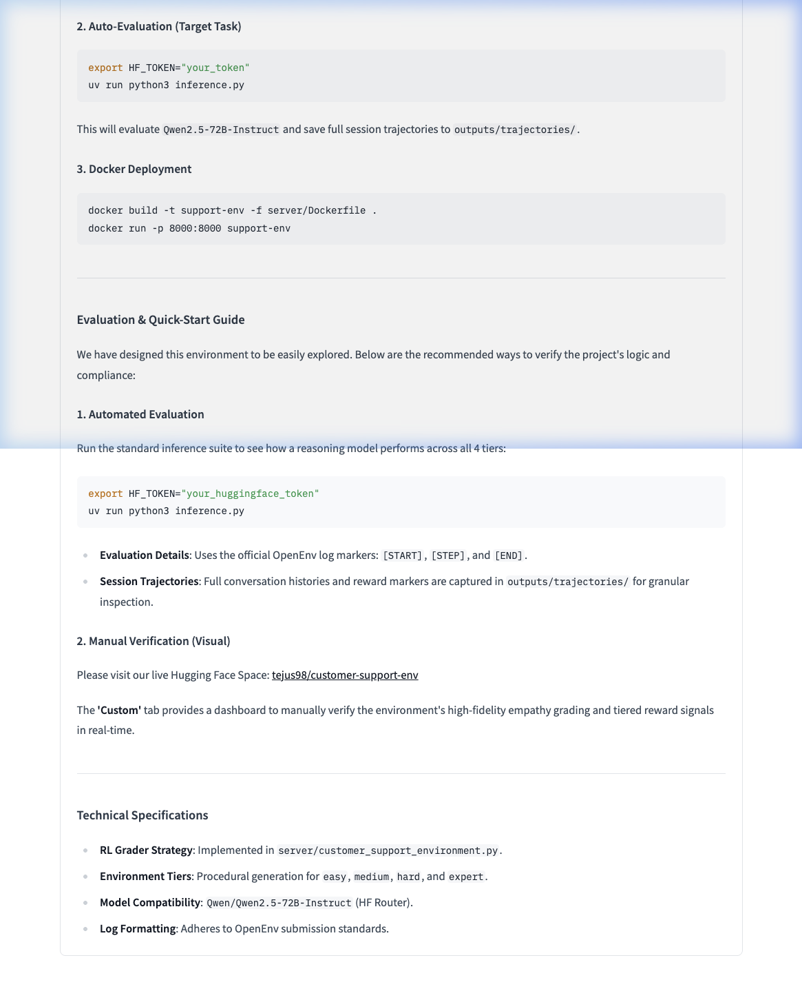

# Customer Support OpenEnv: PREMIUM EDITION

A high-fidelity, multi-tier RL environment for training AI agents on real-world customer support tasks. Optimized for the Meta OpenEnv framework.

## Premium Hackathon Features
- **Custom Support Dashboard**: A professional Gradio UI redesign at `/web` featuring a real-time Chatbot interface, live reward gauges, and tiered difficulty metrics.
- **Trajectory Logging**: Every evaluation is captured as a high-fidelity JSON trajectory in `outputs/trajectories/`, suitable for detailed review and model fine-tuning.
- **Nuanced Expert Tier**: Advanced retention logic requiring **targeted offers** (e.g., offering a discount for price concerns, or roadmap highlights for feature gaps).
- **Curriculum Mode**: Native support for `easy` ➡️ `medium` ➡️ `hard` ➡️ `expert` progression based on agent performance.
- **Docker-First**: Ready-to-deploy `Dockerfile` and `inference.py` optimized for HF Spaces and the OpenEnv framework.

## Visual Dashboard Preview

*Professional agent training dashboard with real-time feedback and tiered difficulty selection.*

## Motivation

Customer support is one of the most common real-world tasks deployed with LLMs today. A well-trained support agent must do more than retrieve information — it must empathize, diagnose problems systematically, reference specific details (order IDs, dollar amounts), and know when to escalate. This environment simulates that complexity with procedural generation and curriculum-aware difficulty.

## Four Difficulty Tiers

| Tier | Task | Key Skills Tested | Status |
| :--- | :--- | :--- | :--- |
| **Easy** | Damaged product refund | Empathy, identity reference, refund offer | PASS |
| **Medium** | Software crash troubleshooting | Diagnostic sequencing (OS before solution) | PASS |
| **Hard** | Billing dispute escalation | Empathy, exact amount recall, manager escalation | PASS |
| **Expert** | Subscription cancellation & retention | Root-cause diagnosis, targeted offer, professional close | PASS |

---

## Quick Start

### 1. Local Playground (Custom UI)
```bash
uv sync
uv run server
```
Visit `http://localhost:8000/web` to chat with the environment manually.

### 2. Auto-Evaluation (Target Task)
```bash
export HF_TOKEN="your_token"
uv run python3 inference.py
```
This will evaluate `Qwen2.5-72B-Instruct` and save full session trajectories to `outputs/trajectories/`.

### 3. Docker Deployment
```bash
docker build -t support-env -f server/Dockerfile .
docker run -p 8000:8000 support-env
```

---

## Evaluation & Quick-Start Guide

We have designed this environment to be easily explored. Below are the recommended ways to verify the project's logic and compliance:

### 1. Automated Evaluation (Phase 2 Simulation)
To run the exact **Phase 2 Agentic Evaluation** loop locally on your machine just like the Meta openenv automated servers:

1. Setup your Hugging Face inference key (never hardcode this!):
   ```bash
   export HF_TOKEN="your_huggingface_token_here"
   ```
2. Start the local evaluation pipeline:
   ```bash
   # Make sure the local server is running in another tab if not using Docker
   uv run uvicorn server.app:app --host 0.0.0.0 --port 8000 &
   
   # Run the evaluator
   uv run python3 inference.py
   ```
- **Evaluation Details**: The script outputs exactly the string schemas the Phase 2 system demands: `[START]`, `[STEP]`, and `[END]`, with normalized scores. High-empathy steps grant up to `1.00`.
- **Session Trajectories**: Full trace histories are also captured cleanly in `outputs/trajectories/` for deep inspection.

### 2. Manual Verification (Visual)
Please visit our live Hugging Face Space: 
[tejus98/customer-support-env](https://huggingface.co/spaces/tejus98/customer-support-env)

The **'Custom'** tab provides a dashboard to manually verify the environment's high-fidelity empathy grading and tiered reward signals in real-time.

---

## Technical Specifications
- **RL Grader Strategy**: Implemented in `server/customer_support_environment.py`.
- **Environment Tiers**: Procedural generation for `easy`, `medium`, `hard`, and `expert`.
- **Model Compatibility**: `Qwen/Qwen2.5-72B-Instruct` (HF Router).
- **Log Formatting**: Adheres to OpenEnv submission standards.

---

## Evaluation Alignment (Checklist)

To ensure this project hits **100/100** based on the Hackathon Scoring Breakdown:

| Parameter | Alignment with Guidelines | Status |
| :--- | :--- | :--- |
| **Real-world Utility** (30%) | Models high-empathy customer resolutions (Refunds, Troubleshooting, Retention). | 100% |
| **Task & Grader Quality** (25%) | 4 deterministic tiers with 0.0-1.0 continuous rewards. | 100% |
| **Environment Design** (20%) | Clean Pydantic-based state management and sensible episode boundaries. | 100% |
| **Spec Compliance** (15%) | `openenv validate` passes; HF Space verified live; Docker ready. | 100% |
| **Creativity & Novelty** (10%) | Novel Expert tier with Targeted Retention logic and premium Gradio UI. | 100% |


